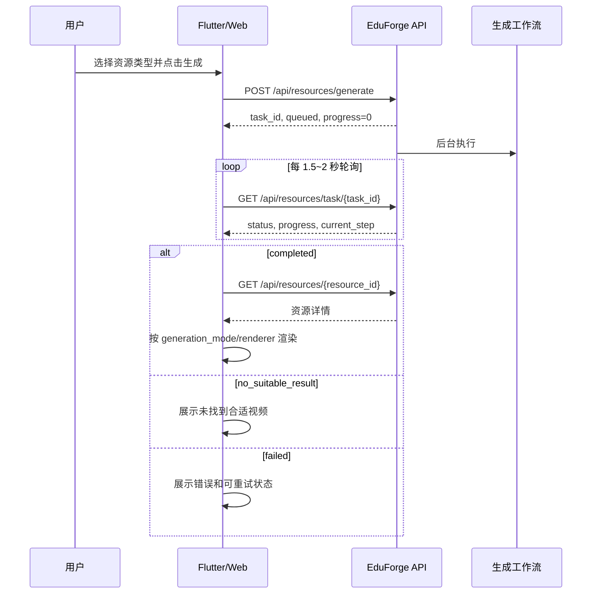

# 个性化学习资源生成 v2 前端对接文档

本文面向 Flutter、Web 和管理端前端开发，描述 EduForge AI 后端当前已经实现的资源生成接口。除特别说明外，接口前缀均为 `/api`，请求和响应使用 UTF-8 JSON。

## 1. 基础约定

### 1.1 认证

除短期签名课件地址外，所有接口都需要 JWT：

```http
Authorization: Bearer <access_token>
Content-Type: application/json
```

签名后的 `/api/generated-resources/{token}/...` 不再携带 JWT。不要把长期 JWT 拼到 WebView URL、query 参数或 HTML 中。

### 1.2 统一响应

成功和失败都使用统一业务信封：

```json
{
  "code": 0,
  "message": "success",
  "data": {}
}
```

前端必须同时判断 HTTP 状态码和 `code`。常用业务码如下：

| code | 含义 | 建议处理 |
| ---: | --- | --- |
| `0` | 成功 | 解析 `data` |
| `40000` | 参数错误 | 展示字段或范围错误 |
| `40100` | 未登录、Token 或课件签名失效 | JWT 接口刷新登录；课件接口重新获取签名 URL |
| `40300` | 无权限 | 返回上一页并提示 |
| `40400` | 任务、资源或文件不存在 | 刷新列表 |
| `40900` | 接口冲突或旧接口不再承载该能力 | 切换统一异步接口 |
| `42900` | 请求过于频繁 | 延迟重试 |
| `50000` | 服务端异常 | 展示重试入口并上报日志 |
| `51000` | 大模型调用异常 | 根据任务的 `retryable` 决定是否重试 |
| `52000` | 知识检索异常 | 提示课程资料尚未准备好 |
| `53000` | Agent 任务异常 | 展示 `failed_step` 和重试入口 |

### 1.3 资源类型和范围

资源类型：

```text
illustration | document | mind_map | exercise | code_case | video | ppt
```

生成范围：

```text
section | chapter | course
```

约束：

- `section`：新接口必须传 `section_id`，推荐同时传所属 `chapter_id`。
- `chapter`：必须传 `chapter_id`。
- `course`：不要求章节 ID，但不支持 `illustration`。
- 其他六种资源均支持 section、chapter、course；illustration 支持 section、chapter。
- `knowledge_point_ids` 可以为空，但有明确知识点时应传真实 ID。

## 2. 推荐交互流程



前端不要在资源列表刷新时自动触发生成。只有用户明确点击“生成”或“重新生成”时才创建任务。

## 3. 创建生成任务

### `POST /api/resources/generate`

权限：学生、教师、管理员。

推荐使用单资源新协议：

```json
{
  "course_id": "course_ml",
  "chapter_id": "chapter_tree",
  "section_id": "section_entropy",
  "knowledge_point_ids": ["kp_entropy", "kp_gain"],
  "resource_type": "ppt",
  "user_request": "生成适合初学者的图解型互动课件",
  "generation_scope": "section",
  "difficulty": "基础",
  "use_profile": true
}
```

字段说明：

| 字段 | 类型 | 必填 | 说明 |
| --- | --- | --- | --- |
| `course_id` | string | 是 | 课程 ID |
| `chapter_id` | string/null | 按范围 | 章节 ID |
| `section_id` | string/null | section 必填 | 小节 ID |
| `knowledge_point_ids` | string[] | 否 | 知识点 ID 列表，默认空数组 |
| `resource_type` | enum | 是 | 新协议一次只生成一种资源 |
| `user_request` | string/null | 否 | 用户补充要求，最多 2000 字符 |
| `generation_scope` | enum | 是 | 默认 `section` |
| `difficulty` | string | 否 | `基础`、`中等`、`提高`，默认 `基础` |
| `use_profile` | bool | 否 | 是否结合学生画像，默认 `true` |

成功响应：

```json
{
  "code": 0,
  "message": "资源生成任务已创建",
  "data": {
    "task_id": "ed9475c8-891a-4ef6-8e42-5553c488315a",
    "status": "queued",
    "progress": 0,
    "message": "资源生成任务已创建，正在后台执行"
  }
}
```

请求成功只代表任务已创建，不代表资源已经生成。必须进入任务轮询。

## 4. 查询任务状态

### `GET /api/resources/task/{task_id}`

权限：学生、教师、管理员。学生只能读取自己的任务。

```json
{
  "code": 0,
  "message": "success",
  "data": {
    "task_id": "ed9475c8-891a-4ef6-8e42-5553c488315a",
    "status": "reviewing",
    "progress": 84,
    "current_step": "执行分类型质量与安全审核",
    "resource_ids": [],
    "agent_task_id": "agent_task_xxx",
    "steps": [],
    "error_message": null,
    "error_code": null,
    "failed_step": null,
    "retryable": false,
    "retry_count": 0
  }
}
```

可能出现的状态：

| 状态 | 是否终态 | UI 建议 |
| --- | --- | --- |
| `queued` | 否 | 排队中 |
| `running` | 否 | 准备执行 |
| `loading_profile` | 否 | 正在分析学习画像 |
| `loading_course` | 否 | 正在读取课程结构 |
| `planning` | 否 | 正在规划资源 |
| `retrieving` | 否 | 正在检索课程知识 |
| `searching_external` | 否 | 正在搜索公开视频 |
| `generating_content` | 否 | 正在生成内容 |
| `rendering_html` | 否 | 正在渲染课件 |
| `checking_html` | 否 | 正在检查课件布局和安全性 |
| `reviewing` | 否 | 正在质量审核 |
| `saving` | 否 | 正在保存 |
| `completed` | 是 | 读取 `resource_ids` 并进入详情 |
| `no_suitable_result` | 是 | 视频没有合格候选；不是系统异常 |
| `failed` | 是 | 展示错误和重试操作 |

轮询建议：

- 前台页面每 1.5～2 秒轮询一次。
- App 进入后台后暂停轮询，恢复前台时立即查一次。
- 单次网络错误可退避到 3、5、8 秒，不要新建重复任务。
- 终态立即停止轮询。
- `completed` 后以 `resource_ids` 为准，不能假设永远只有一个 ID；新协议当前通常返回一个。
- `steps` 当前可能为空，进度展示应以 `progress` 和 `current_step` 为主。

`GET /api/agent-tasks/{task_id}` 是兼容入口，新页面不要依赖它。

## 5. 获取资源详情

### `GET /api/resources/{resource_id}`

当前权限：学生，且服务会按当前学生上下文返回资源详情。

```json
{
  "code": 0,
  "message": "success",
  "data": {
    "resource_id": "res_5ca2fe8f216e4f03b255",
    "student_id": "user_xxx",
    "course_id": "course_ml",
    "knowledge_point_id": null,
    "title": "信息熵与信息增益",
    "type": "ppt",
    "difficulty": "基础",
    "description": "...",
    "reason": "...",
    "content_text": "...",
    "content_json": {},
    "generation_scope": "section",
    "source_type": "generated",
    "generation_mode": "interactive_html_slides",
    "external_provider": null,
    "external_id": null,
    "file_url": "/api/resources/res_xxx/html-entry",
    "preview_url": "/api/resources/res_xxx/preview",
    "review_score": 1.0,
    "favorite": false,
    "review_status": "auto_passed",
    "created_at": "2026-07-18T12:00:00+08:00",
    "updated_at": "2026-07-18T12:00:00+08:00"
  }
}
```

渲染判断优先级：

1. `generation_mode`
2. `content_json.visualization.renderer`
3. `type`
4. `content_text` 兜底

不要只依赖 `type` 判断 PPT 是否为 HTML，也不要把 `file_url` 当作最终 HTML 文件地址；它是获取短期入口的稳定 API。

## 6. 七类资源的渲染协议

| type | generation_mode | renderer/主要字段 | 前端行为 |
| --- | --- | --- | --- |
| `ppt` | `interactive_html_slides` | `frontend_slides_html` | 获取签名 URL 后用 WebView 打开 |
| `video` | `external_video` | `external_link`, `video_url` | 打开 Bilibili 公开页面，不交给 MP4 播放器 |
| `mind_map` | `course_relation_map` | 关系树字段 | 使用树图/关系图组件 |
| `illustration` | `ai_generated` | `visualization` | 按 visualization 类型展示，缺失时显示文本 |
| `document` | `ai_generated` | `content_text/content_json` | 富文本或结构化文档页 |
| `exercise` | `ai_generated` | `content_json` | 题目组件；未知结构时 JSON/文本兜底 |
| `code_case` | `ai_generated` | `content_json/content_text` | 代码高亮与说明区 |

所有资源卡片至少应支持：标题、类型、难度、生成状态、收藏、进入详情。对于未知的 `generation_mode` 或 `renderer`，必须使用通用文本页兜底，不能白屏。

## 7. HTML 互动课件

### 7.1 获取短期入口

### `GET /api/resources/{resource_id}/html-entry`

权限：学生、教师、管理员；学生只能访问自己的资源。

```json
{
  "code": 0,
  "message": "success",
  "data": {
    "resource_id": "res_5ca2fe8f216e4f03b255",
    "html_url": "/api/generated-resources/<signed-token>/index.html",
    "cover_url": "/api/generated-resources/<signed-token>/cover.png",
    "expires_at": "2026-07-18T08:15:00+00:00"
  }
}
```

`html_url` 和 `cover_url` 是相对 URL，前端必须基于 API origin 补全。例如：

```dart
Uri resolveApiUrl(String apiOrigin, String value) {
  return Uri.parse(apiOrigin).resolve(value);
}
```

### 7.2 WebView 要求

- 开启 JavaScript；脚本来自后端固定可信模板。
- 使用横屏全屏容器，课件舞台固定 16:9、1920×1080，并在 WebView 内等比例缩放。
- 支持模板内的点击、键盘、滚轮和左右滑动翻页。
- 不要注入业务 JavaScript，不要重写课件 DOM/CSS。
- 不要在 WebView 请求上附加长期 JWT；签名 URL 本身就是短期访问凭证。
- 禁止记录完整签名 URL 到埋点、Crash 日志和第三方分析平台。
- 到达 `expires_at` 前可以继续使用；过期或 WebView 收到 401 时重新请求 `html-entry`。
- 不要长期缓存签名 URL。资源卡片封面可以使用稳定的认证接口 `/api/resources/{id}/preview`。

Flutter WebView 伪代码：

```dart
Future<void> openSlides(String resourceId) async {
  final entry = await api.get('/api/resources/$resourceId/html-entry');
  final htmlUri = resolveApiUrl(apiOrigin, entry.data['html_url']);

  await SystemChrome.setPreferredOrientations([
    DeviceOrientation.landscapeLeft,
    DeviceOrientation.landscapeRight,
  ]);

  controller
    ..setJavaScriptMode(JavaScriptMode.unrestricted)
    ..setNavigationDelegate(NavigationDelegate(
      onHttpError: (error) {
        if (error.response?.statusCode == 401) {
          refreshSlidesEntry(resourceId);
        }
      },
    ))
    ..loadRequest(htmlUri);
}
```

退出页面时恢复应用原有方向设置。

### 7.3 封面接口

`GET /api/resources/{resource_id}/preview` 返回 `image/png`，需要 Bearer Token。它不是统一 JSON 响应，图片组件需要支持带认证请求头或先通过网络层缓存为本地文件。

## 8. Bilibili 视频资源

`content_json` 关键结构：

```json
{
  "overview": "精选教学视频帮助学生理解信息熵",
  "key_takeaways": ["信息熵", "信息增益"],
  "video_mode": "external_video",
  "provider": "bilibili",
  "primary_video": {
    "provider": "bilibili",
    "external_id": "BV1xxxxxxxxx",
    "title": "视频标题",
    "description": "视频简介",
    "author": "UP 主",
    "duration_seconds": 720,
    "cover_url": "https://...",
    "target_url": "https://www.bilibili.com/video/BV1xxxxxxxxx",
    "tags": [],
    "published_at": "2026-01-01T00:00:00Z",
    "view_count": 1000,
    "danmaku_count": 20,
    "match_score": 0.86,
    "match_reason": "..."
  },
  "alternatives": [],
  "visualization": {
    "renderer": "external_link",
    "video_url": "https://www.bilibili.com/video/BV1xxxxxxxxx",
    "thumbnail_url": "https://...",
    "mime_type": "text/html"
  }
}
```

前端规则：

- 使用 `visualization.video_url` 或 `primary_video.target_url` 打开公开播放页。
- 这是网页 URL，不是 MP4、DASH 或 m3u8，不能传给原生 `video_player`。
- 可用系统浏览器、应用内浏览器或允许 Bilibili 域名的 WebView。
- `no_suitable_result` 是正常终态：显示“暂未找到匹配度足够的公开视频”，允许用户修改关键词后重新生成。
- 不要自行拼接流地址、下载或缓存视频内容。

## 9. 课程关系思维导图

核心结构：

```json
{
  "overview": "...",
  "key_takeaways": [],
  "scope": {
    "course_id": "course_ml",
    "course_title": "机器学习",
    "current_chapter_id": "chapter_tree",
    "current_chapter_title": "决策树",
    "current_section_id": "section_entropy",
    "current_section_title": "信息熵与信息增益"
  },
  "current_chapter_tree": {
    "title": "决策树",
    "knowledge_point_id": null,
    "children": []
  },
  "intra_chapter_relations": [],
  "cross_chapter_relations": [],
  "related_chapters": [],
  "visualization": null,
  "tree": {}
}
```

关系字段：

```text
source_knowledge_point_id
source_title
target_knowledge_point_id
target_title
relation_type
relation_label
direction
reason
strength
source_chunk_ids
```

跨章关系额外提供 `target_chapter_id` 和 `target_chapter_title`。

`relation_type` 可能值：

```text
prerequisite | foundation_for | derived_from | used_by | contrasts_with |
similar_to | extends | solves_problem_of | implementation_of | example_of |
calculation_basis | evaluation_of
```

`direction`：`source_to_target | target_to_source | bidirectional`。

渲染建议：

- 默认先渲染 `current_chapter_tree`。
- 用实线展示 `intra_chapter_relations`，虚线或另一颜色展示 `cross_chapter_relations`。
- 节点点击后显示 `reason`、`strength` 和关联章节。
- `tree` 是旧客户端兼容字段，与 `current_chapter_tree` 等价；新页面只读取后者。
- `visualization` 当前可能为 `null`，前端需要自行布局树图。

## 10. 我的资源和收藏

### 我的资源

```http
GET /api/resources/my?type=ppt&difficulty=基础&course_id=course_ml&page=1&page_size=10
```

权限：学生。返回 `items`、`total`、`page`、`page_size`。

### 收藏列表

```http
GET /api/resources/favorites?page=1&page_size=10
```

### 设置收藏

```http
POST /api/resources/{resource_id}/favorite
```

```json
{
  "favorite": true
}
```

### 提交反馈

```http
POST /api/resources/{resource_id}/feedback
```

```json
{
  "liked": true,
  "favorite": true,
  "difficulty_feedback": "合适",
  "comment": "图示很清晰"
}
```

### 记录学习行为

```http
POST /api/resources/{resource_id}/view
```

只在用户真实进入资源详情时调用一次，不要在卡片曝光时调用。

## 11. 教师审核与重新生成

### 审核列表

```http
GET /api/resources/review-list?course_id=course_ml&type=ppt&review_status=pending&page=1&page_size=10
```

权限：教师、管理员。

### 审核

```http
POST /api/resources/{resource_id}/review
```

```json
{
  "action": "approve",
  "comment": "内容准确，可以发布"
}
```

`action`：`approve | reject | need_modify | regenerate`。

### 重新生成

```http
POST /api/resources/{resource_id}/regenerate
```

```json
{
  "reason": "减少文字并增加一个例题",
  "keep_references": true
}
```

接口返回新的 `task_id`，之后仍使用 `/api/resources/task/{task_id}` 轮询。

注意：当前 `GET /api/resources/{resource_id}` 详情接口只开放给学生；教师审核页应以 `review-list` 返回字段为基础。若教师端需要完整内容详情，需要后端另行扩展 ACL 后再对接，前端不要依赖越权请求。

## 12. 删除资源

删除单个资源：

```http
DELETE /api/resources/{resource_id}
```

删除本人生成资源：

```http
DELETE /api/resources/generated/all?course_id=course_ml&all_students=false
```

`all_students=true` 仅管理员可用。删除操作必须二次确认；任务进行中时前端应避免提供删除按钮。

## 13. 旧协议兼容

旧请求仍可使用：

```json
{
  "course_id": "course_ml",
  "knowledge_point": "信息熵",
  "goal": "理解信息增益",
  "resource_types": ["ppt", "video_script"],
  "difficulty": "基础"
}
```

兼容规则：

- `video_script` 自动映射为 `video`。
- 旧协议允许一次传多个 `resource_types`，因此 `resource_ids` 可能包含多个结果。
- 新页面必须使用单一 `resource_type`，以便状态、失败重试和资源卡片一一对应。
- 旧小节同步资源壳只保留 illustration、code_case、exercise、mind_map 的原顺序；PPT、视频、文档应使用统一异步入口。

## 14. Flutter 数据模型建议

```dart
class ApiEnvelope<T> {
  final int code;
  final String message;
  final T? data;

  const ApiEnvelope({required this.code, required this.message, this.data});
}

class ResourceTask {
  final String taskId;
  final String status;
  final int progress;
  final String? currentStep;
  final List<String> resourceIds;
  final String? errorCode;
  final String? errorMessage;
  final String? failedStep;
  final bool retryable;
  final int retryCount;

  bool get isTerminal => const {
    'completed', 'failed', 'no_suitable_result'
  }.contains(status);
}

class LearningResource {
  final String resourceId;
  final String type;
  final String title;
  final String? generationMode;
  final String? fileUrl;
  final String? previewUrl;
  final Map<String, dynamic> contentJson;
}
```

解析时必须允许新增字段，并为可空字段设置默认值。不要对 `content_json` 使用封闭式枚举反序列化，否则后端扩展 visualization 时可能导致整个详情页解析失败。

## 15. 轮询参考实现

```dart
Future<ResourceTask> waitForResourceTask(String taskId) async {
  var delay = const Duration(seconds: 2);

  while (true) {
    final response = await api.get('/api/resources/task/$taskId');
    final task = ResourceTask.fromJson(response.data);

    onProgress(task.progress, task.currentStep);
    if (task.isTerminal) return task;

    await Future.delayed(delay);
    if (delay < const Duration(seconds: 5)) {
      delay += const Duration(milliseconds: 500);
    }
  }
}
```

实际 App 中应将轮询与页面生命周期、取消令牌和网络状态结合；用户离开页面不代表要取消后端任务，可在“我的资源”或任务中心恢复查看。

## 16. 联调验收清单

- [ ] 所有业务接口都携带 Bearer Token。
- [ ] 创建任务后没有把 `queued` 当作生成完成。
- [ ] 轮询使用 `/api/resources/task/{task_id}`，终态后停止。
- [ ] 正确处理 `completed`、`failed`、`no_suitable_result` 三种终态。
- [ ] 一个任务可处理多个 `resource_ids`，即使新协议通常只有一个。
- [ ] PPT 使用 html-entry 获取短期 URL，未把长期 JWT 放入 WebView URL。
- [ ] 相对 `html_url/cover_url` 已基于 API origin 补全。
- [ ] 课件链接过期或 401 后会刷新签名。
- [ ] WebView 开启 JavaScript，并在退出时恢复屏幕方向。
- [ ] 视频 URL 使用浏览器/WebView 打开，没有交给 MP4 播放器。
- [ ] 思维导图优先读取 `current_chapter_tree`，兼容旧 `tree`。
- [ ] 未知 renderer 有文本兜底，不会白屏。
- [ ] App 进入后台后暂停轮询，恢复后继续查询同一个任务。
- [ ] 不在列表加载、卡片曝光或页面重建时重复创建任务。
- [ ] 删除、重生成等操作有确认和防重复点击。
- [ ] 日志、埋点和 Crash 平台不记录签名课件 URL。

## 17. 当前已知限制

- 任务在应用进程内后台执行，服务重启时不是持久化消息队列语义；前端必须允许失败后重新发起。
- Bilibili 搜索可能受网络、区域或平台风控影响，`no_suitable_result` 必须有正常 UI。
- 教师/管理员当前没有通用完整资源详情接口，审核页先使用审核列表字段。
- `steps` 可能为空，不能用它决定任务是否卡住。
- 思维导图当前由前端负责可视化布局。
- PPT 是 HTML 互动课件，不提供 PPTX 下载或原生幻灯片文件。
